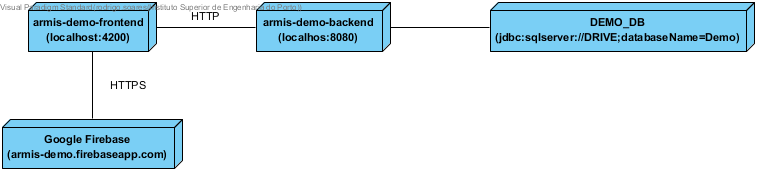
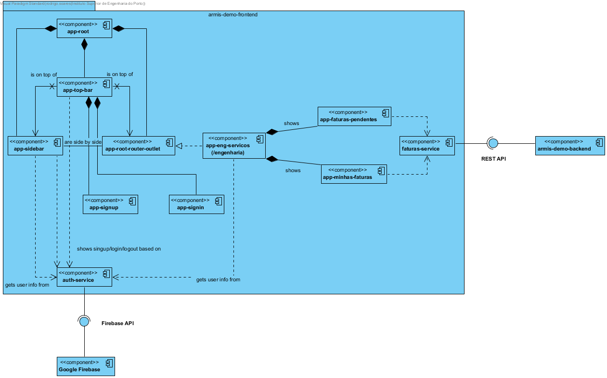

# ARMIS-Demo, by Rod, Rodd & Rodri, inc.

## System Overview

### Component View

### Deployment View

## ARMIS Demo Frontend Overview

### Component View

## ARMIS Demo Backend Overview

### Component View

### Tests

## Firebase Console

## Future improvements (or things I'd do differently now that I know better)

### ARMIS Demo Frontend
- Implement Windows Authentication in Angular. Initial analysis pointed to it not being possible, but https://spikesapps.wordpress.com/2017/08/04/how-to-implement-windows-authentication-in-an-angular-4-3-1-application-with-a-stand-alone-web-api/ seems to have a way to do it;

- Improve frontend look. I had zero understanding of HTML+CSS in Angular prior to this, and looking back on it, I'd definitely do it from scratch in a much more coherent way if I had the chance. Angular components need to be structured in a more cohesive manner, additional router-modules might be beneficial, HTML needs an almost complete revamp to properly use the different HTML classes and types available, and CSS should be redone to avoid micro-managing each individual element in an overly complex way;

- Implement Search function;

### ARMIS Demo Backend
- Implement Authentication on the backend. Right now, ANYONE can access data provided they know the correct route;

- Use a Java ORM tool, like Hibernate. Right now I'm accessing the database through pure SQL which, although functional, might be harder to maintain long-term. This was however a necessary evil to avoid too much complexity in Sprint 1;

-

# ArmisDemoFrontend

This project was generated with [Angular CLI](https://github.com/angular/angular-cli) version 7.3.3.

## Development server

Run `ng serve` for a dev server. Navigate to `http://localhost:4200/`. The app will automatically reload if you change any of the source files.

## Code scaffolding

Run `ng generate component component-name` to generate a new component. You can also use `ng generate directive|pipe|service|class|guard|interface|enum|module`.

## Build

Run `ng build` to build the project. The build artifacts will be stored in the `dist/` directory. Use the `--prod` flag for a production build.

## Running unit tests

Run `ng test` to execute the unit tests via [Karma](https://karma-runner.github.io).

## Running end-to-end tests

Run `ng e2e` to execute the end-to-end tests via [Protractor](http://www.protractortest.org/).

## Further help

To get more help on the Angular CLI use `ng help` or go check out the [Angular CLI README](https://github.com/angular/angular-cli/blob/master/README.md).
